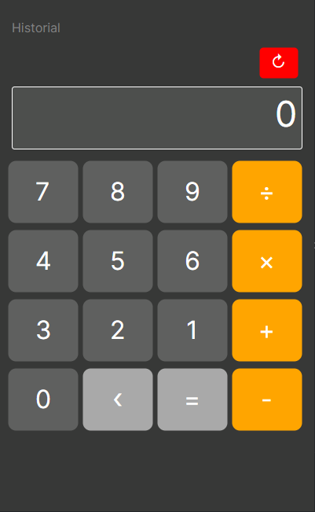

<pre>
 $$$$$$\                       $$$$$$\            $$\           
$$  __$$\                     $$  __$$\           $$ |          
$$ /  $$ |$$\    $$\ $$$$$$\  $$ /  \__| $$$$$$\  $$ | $$$$$$$\ 
$$$$$$$$ |\$$\  $$  |\____$$\ $$ |       \____$$\ $$ |$$  _____|
$$  __$$ | \$$\$$  / $$$$$$$ |$$ |       $$$$$$$ |$$ |$$ /      
$$ |  $$ |  \$$$  / $$  __$$ |$$ |  $$\ $$  __$$ |$$ |$$ |      
$$ |  $$ |   \$  /  \$$$$$$$ |\$$$$$$  |\$$$$$$$ |$$ |\$$$$$$$\ 
\__|  \__|    \_/    \_______| \______/  \_______|\__| \_______|
</pre>

## Descripción 📋
Una calculadora integrada en una interfaz gráfica sencilla y amigable con el usuario,
perfecta para las operaciones básicas que todos realizamos en el día a día.
Desarrollada en Avalonia, usando como lenguaje principal C# y el framework de .NET.
Gracias a este framework, que es multiplataforma, tenemos la posibilidad de ejecutarla en
muchos sistemas operativos.

    

## Compatibilidad
* **Windows** 💻
* **Linux** 🐧
* **MacOS** 🍎
